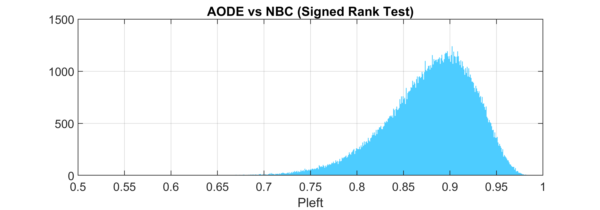
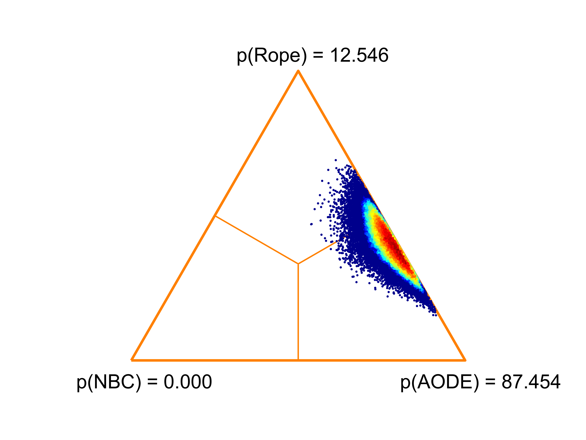

# Bayesian-Analysis-for-Comparing-Classifiers

This is a small MATLAB implementation of some of the functionalities of JanezDemsar’s Python library `baycomp` available here: https://github.com/janezd/baycomp. The code can be used for comparing two classifiers using the Signed Rank Test proposed in the paper: A. Benavoli, G. Corani, J. Demsar, M. Zaffalon, "Time for a Change: a Tutorial for Comparing Multiple Classifiers Through Bayesian Analysis", Journal of Machine Learning Research 18 (2017) 1-36. 

The repository contains the following files:

- `BayesianAnalyisExample.m` This is an example that runs the Bayesian Analysis and reproduces 
  - Figure 10 (the histogram of theta_left) 
   
  
  - and Figure 11 (the triangle with the point cloud)
   

- `NBC_AODE_differences.xlsx` This is an excel file with the differences between classifiers NBC (Naive Bayes) and AODE (averaged one-dependence estimator). The values are taken from Table 7 in the paper.
- `signed_rank_test_diff.m` This is a function that takes a vector of differences of classifier accuracies across multiple data sets (A-B) and calculates the results of the signed rank test. The function is largely translated from the respective component of the `baycomp` library. It outputs an array with probability density values (theta_left, theta_rope, theta_right) needed for the triangle plot and the set of three probabilities **p_left** (classifier A is better), **p_rope** (the two classifiers are equivalent) and **p_right** (classifier B is better). 
- `barycentric_plot.m` This code is used to plot the triangle diagram with the cloud of simulated points in barycentric coordinates. 
- `density_plot.m` This is a function that produces a scatterplot in the current axes, where each point is coloured depending on the density of its neighbourhood.

```
@misc{KunchevaMATLABBayesian2020,
author = {Ludmila I Kuncheva},
title = {Bayesian-Analysis-for-Comparing-Classifiers},
year = {2020},
publisher = {GitHub},
journal = {GitHub repository},
howpublished = {\url{https://github.com/LucyKuncheva/Bayesian-Analysis-for-Comparing-Classifiers}}
}
```
